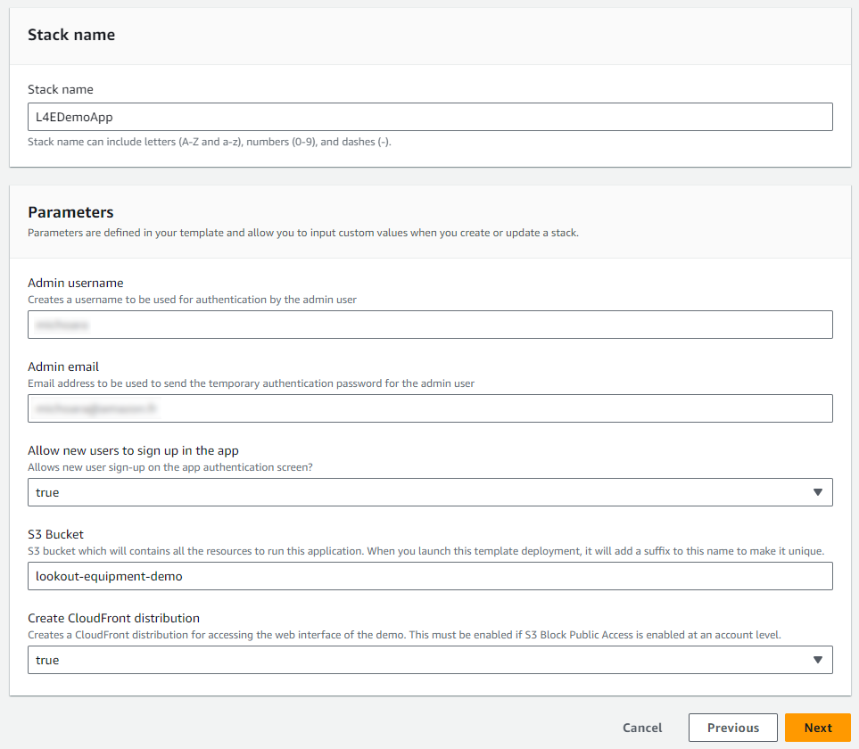
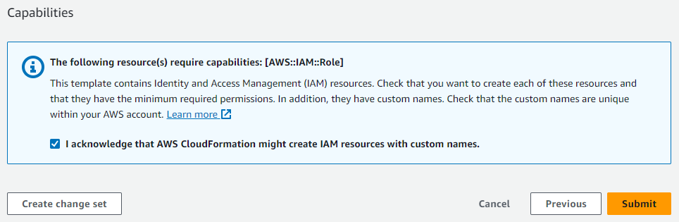
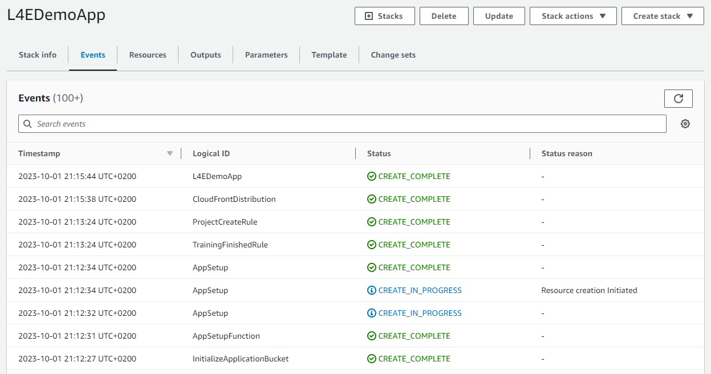
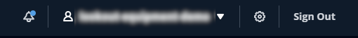
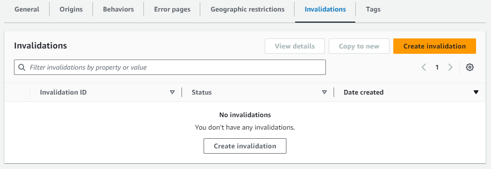
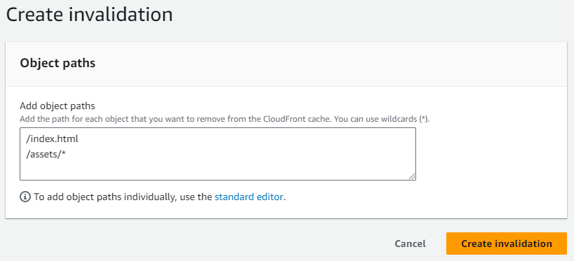

## Installation instructions
### AWS Account creation
[**Create an AWS account**](https://portal.aws.amazon.com/gp/aws/developer/registration/index.html) if
you do not already have one: then you can setup your environment automatically by deploying the following 
CloudFormation template.

### First time deployment
In another browser window, login to your AWS account. Once you have done that, open one of the link below 
(depending on the region closest to you) in a new tab to start the process of deploying the items you need 
via CloudFormation.

*Note: This material is designed to work in the regions where the service is available. Using other regions will cause issues.*

| Region |     | CloudFormation Stack |
| ---    | --- | --- |
| US East (N. Virginia) | **us-east-1** |  |
| Europe (Ireland) | **eu-west-1** |  |
| Asia Pacific (Seoul) | **ap-northeast-2** |  |

After you clicked on one of the `Launch stack` button above, you will be brought to the `Create stack` screen. Start by clicking `Next` at the bottom:

On the parameters page, you will have to fill in:

* `Stack name`: a unique name for your CloudFormation deployment. A default name will have been filled in on your behalf
* `Admin username`: the login the administrator will use to log into the application once installed
* `Admin email`: make sure this is a valid email, the temporary password will be sent to this address
* `Allow new users to sign up in the app`: by default, new users will be able to create their credentials when then land on the authentication page of the app. You can prevent this behavior. Note that in this case, you will have to use the Amazon Cognito console to create the users manually in the backend. However, this will prevent any users with the link to your app to create an account and provision AWS resources in your account
* `S3 bucket`: this bucket will contain all the resources to run this application. Note that a suffix will be added to the name you select to ensure it stays unique
* `Create CloudFront distribution`: the default and recommended parameter is to publish your application behind a CloudFront distribution. This is mandatory if your IT has enforced S3 Block Public Access at an account level. Select "false" if you want your application to be served from a Public S3 bucket (*not recommended*)

Once you're fine with these parameters, click `Next`:

The stack configuration options page will also be fine with the default values, click `Next` to proceed to the Review page. Scroll again to the bottom, check the box to enable the template to create new IAM resources and then click on `Submit`:

CloudFormation will take a few minutes to create the resources described above on your behalf:

Once it is completed, you will see a green CREATE_COMPLETE message next to the name of the stack (on the left panel of the CloudFormation console), indicating that the deployment is completed.

### Updating the app

When a new release of this application is available in this repository, a notification will appear in the top menu bar of the app:

To update the app in your AWS account, follow these steps:

1. Log into your AWS account and navigate to the CloudFormation console
2. Find the initial stack that you deployed at installation time
3. Click the `Update` button at the top and then select `Replace current template`
4. For the Amazon S3 URL, select one of these links, depending on your region:
   - `us-east-1`: https://lookout-equipment-content-us-east-1.s3.amazonaws.com/l4e-demo-app/v1.0.0/cloud-formation-templates/l4e-demo-app-setup.yaml
   - `eu-west-1`: https://lookout-equipment-content-eu-west-1.s3.eu-west-1.amazonaws.com/l4e-demo-app/v1.0.0/cloud-formation-templates/l4e-demo-app-setup.yaml
   - `ap-northeast-1`: https://lookout-equipment-content-ap-northeast-2.s3.ap-northeast-2.amazonaws.com/l4e-demo-app/v1.0.0/cloud-formation-templates/l4e-demo-app-setup.yaml

5. Click `Next`: you should be able to keep the same parameters. Click `Next` again twice to reach the Review stage of the update wizard.
6. Scroll to the bottom of the page, check the box to enable the template to create new IAM resources and then click on `Submit`: The CloudFormation template takes a few minutes to refresh your application and the underlying resources.
7. If you deployed your application behind a CloudFront distribution, you need to refresh the cache to reflect the latest frontend that you just deployed. To do this, navigate to the CloudFront console. Select the distribution with the following description: `The distribution for the Lookout for Equipment Demo`.
8. Click on the `Invalidations` tab and then on the `Create invalidation` button:

9. Add the following object paths: `/index.html` and `/assets/*` and then click on `Create invalidation`:

10. You are brought to the `Invalidation details` page. After a couple minutes, your CloudFront distribution cache is updated and you can use your updated app.

### Uninstalling the demo app

To uninstall the app, you can go back into the CloudFormation console, select the stack you deployed and click on `Delete`: click again on the `Delete` button in the confirmation window and most of the resources deployed will be deleted after a few minutes:

Note that the following resources **won't be deleted**: you can continue using them after the stack is deleted or may go and manually delete them in the console of the different services:

* In **Amazon S3**, the `Application Bucket` will stay: your users will have uploaded their datasets. The deployed models will also store their inference results in this bucket and you may want to keep all these data afterward.
* In **Amazon Lookout for Equipment**, the different datasets, models and schedulers will not be deleted either. Note that you will **continue to incur costs** due to any running inference schedulers. If you don't have any more usage of these schedulers, we recommend that you log into the Lookout for Equipment console and stop any active schedulers (inactive schedulers do not cost anything).

Before deleting the app, you may go into each project dashboard and delete them: this will delete the whole hierarchy of associated resources, including the Lookout for Equipment resources and the files stored in the S3 buckets.