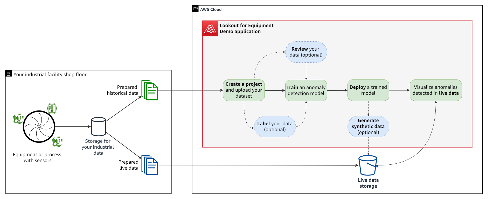

# Amazon Lookout for Equipment Demo Application
Amazon Lookout for Equipment uses the data from your sensors to detect abnormal equipment behavior, so you
can take action before machine failures occur and avoid unplanned downtime.

This application will help you assess quickly if your industrial data contains any historical anomaly of 
interest. After you upload a dataset containing sensor measurements from your industrial equipment or 
manufacturing process, you will be guided to train an anomaly detection model. You will then be able to 
visualize your model results and deploy it, making it ready to receive your shop floor live data. This 
application also includes an operational dashboard to visualize your live results.

The following diagram illustrate the workflow you will follow to train and deploy your first model with 
this application (in the red frame below). The key steps are highlighted in the green boxes while the blue 
ones are optional:



## Table of content

* [Installations instructions](INSTALL.md)
* [Updating the app](INSTALL.md#update)
* [Uninstalling the app](INSTALL.md#uninstall)
* [Usage: first connection](USAGE.md)
* [How to manually create user](USAGE.md#manual-user-creation)
* [Architecture overview](ARCHITECTURE.md)
* [Costs consideration](ARCHITECTURE.md#costs)

## Repository structure
This folder is structured as followed:

```
. amazon-lookout-for-equipment-demo-app/
|
├── index.html                          <-- Entry point of the app
|
├── README.md                           <-- This instruction file
|
├── assets/
|   ├── cloud-formation/                <-- The CloudFormation template YAML file definition
|   ├── lambda-functions/               <-- Lambda functions source code (mostly written in Python)
|   ├── layers/                         <-- Lambda layers
|   ├── screenshots/                    <-- Pictures used in this README.md file
|   └── state-machines/                 <-- Step functions JSON definitions
|
├── public/
|   ├── app.config.js                   <-- File generated at deployment time to configure your app
|   └── *.png, *.gif                    <-- All pictures used by the application
|
└── src/                                <-- Source code of the frontend (mostly written in Javascript)
```

## Questions

Please contact the [**Lookout for Equipment team**](mailto:aws-custfeedback-l4edemoapp@amazon.fr?subject=Lookout%20for%20Equipment%20Demo%20App%20Feedback) or raise an issue against this repository.

## Security

See [CONTRIBUTING](CONTRIBUTING.md#security-issue-notifications) for more information.

## License

This library is licensed under the MIT-0 License. See the [LICENSE](LICENSE) file.