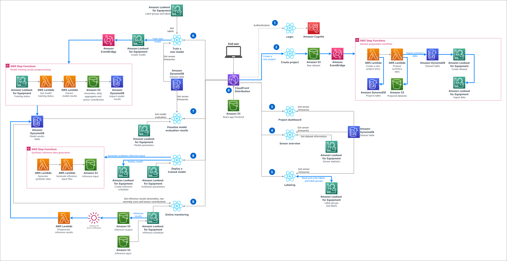

# Amazon Lookout for Equipment Demo Application
Amazon Lookout for Equipment uses the data from your sensors to detect abnormal equipment behavior, so you
can take action before machine failures occur and avoid unplanned downtime.

This application will help you assess quickly if your industrial data contains any historical anomaly of 
interest. After you upload a dataset containing sensor measurements from your industrial equipment or 
manufacturing process, you will be guided to train an anomaly detection model. You will then be able to 
visualize your model results and deploy it, making it ready to receive your shop floor live data. This 
application also includes an operational dashboard to visualize your live results.

The following diagram illustrate the workflow you will follow to train and deploy your first model with 
this application (in the red frame below). The key steps are highlighted in the green boxes while the blue 
ones are optional:


## Installation instructions
### AWS Account creation
[**Create an AWS account**](https://portal.aws.amazon.com/gp/aws/developer/registration/index.html) if
you do not already have one: then you can setup your environment automatically by deploying the following 
CloudFormation template.

### Deploy the application
In another browser window, login to your AWS account. Once you have done that, open one of the link below 
(depending on the region closest to you) in a new tab to start the process of deploying the items you need 
via CloudFormation.

*Note: This material is designed to work in the regions where the service is available. Using other regions will cause issues.*

| Region |     | CloudFormation Stack |
| ---    | --- | --- |
| US East (N. Virginia) | **us-east-1** | [](https://us-east-1.console.aws.amazon.com/cloudformation/home?region=us-east-1#/stacks/new?stackName=L4EDemoApp&templateURL=https://lookout-equipment-content-us-east-1.s3.amazonaws.com/l4e-demo-app/v1.0.0/cloud-formation-templates/l4e-demo-app-setup.yaml) |
| Europe (Ireland) | **eu-west-1** | [](https://eu-west-1.console.aws.amazon.com/cloudformation/home?region=eu-west-1#/stacks/new?stackName=L4EDemoApp&templateURL=https://lookout-equipment-content-eu-west-1.s3.eu-west-1.amazonaws.com/l4e-demo-app/v1.0.0/cloud-formation-templates/l4e-demo-app-setup.yaml) |
| Asia Pacific (Seoul) | **ap-northeast-2** | [](https://ap-northeast-2.console.aws.amazon.com/cloudformation/home?region=ap-northeast-2#/stacks/new?stackName=L4EDemoApp&templateURL=https://lookout-equipment-content-ap-northeast-2.s3.ap-northeast-2.amazonaws.com/l4e-demo-app/v1.0.0/cloud-formation-templates/l4e-demo-app-setup.yaml) |

After you clicked on the `Launch stack` button above, you will be brought to the `Create stack` screen. Start by clicking `Next` at the bottom:

To be finished...

### Uninstalling the demo app

To do

## Usage
Once the template is deployed, stay on the CloudFormation service page and navigate to the ouput tab.

To do

## Architecture overview
This template will deploy the following components in your AWS account:



1. Deploy this AWS Solution into your AWS account. Open the App and use Amazon Cognito to authenticate.
2. To create a new project, end user uploads a CSV file that will be used to create an Amazon Lookout for Equipment project. Data will also be prepared for visualization purpose in the app. The prepared data will be stored in a DynamoDB table.
3. Once a project is created, user can visualize the project attributes and a summary of the ingested dataset
4. User can also dive deeper in the sensor data, visualize sensor grade results, timeseries and value distributions
5. The labeling page allows users to create labels and group them in label groups.
6. User can train a model. The application will monitor the training process. Once training is finished, the results will be postprocessed: the anomalies and the sensor contributions will be stored in DynamoDB tables.
7. After training, user can visualize model results: anomalies, sensor contribution, sensor behavior deep dive between training and evaluation range (when provided).
8. User can deploy a model. The same page also allows the user to trigger synthetic data generation to populate the input inference bucket based on extracts from the historical data.
9. After a model is deployed, the app will monitor new inference results and store them in DynamoDB tables. Users has access to a deep dive dashboard to understand the anomalies detected in the process or piece of equipment monitored.

### Costs consideration

To do

### Repository structure
This folder is structured as followed:

```
. cloudwatch-dashboard/
|
├── README.md                          <-- This instruction file
|
├── assets/                            <-- Pictures used throughout the README file
|
├── layers/                            <-- Lambda layers
|   |
|   ├── lookout-equipment/             <-- Utility layers used by the Lambda functions
|   |
|   └── create-layer.sh                <-- Script to generate a layer from a public
|                                          package such as `pandas` or `matplotlib`
|
├── lambdas/                           <-- Lambda functions source code
|
└── synthetics/                        <-- Synthetics canary code to take dashboard snapshots
```

## Questions

Please contact the [**Lookout for Equipment team**](mailto:aws-custfeedback-l4edemoapp@amazon.fr?subject=Lookout%20for%20Equipment%20Demo%20App%20Feedback) or raise an issue on this repository.

## Security

See [CONTRIBUTING](CONTRIBUTING.md#security-issue-notifications) for more information.

## License

This library is licensed under the MIT-0 License. See the LICENSE file.