# Amazon Lookout for Equipment Demo Application
Amazon Lookout for Equipment uses the data from your sensors to detect abnormal equipment behavior, so you
can take action before machine failures occur and avoid unplanned downtime.

This application will help you assess quickly if your industrial data contains any historical anomaly of 
interest. After you upload a dataset containing sensor measurements from your industrial equipment or 
manufacturing process, you will be guided to train an anomaly detection model. You will then be able to 
visualize your model results and deploy it, making it ready to receive your shop floor live data. This 
application also includes an operational dashboard to visualize your live results.

The following diagram illustrate the workflow you will follow to train and deploy your first model with 
this application (in the red frame below). The key steps are highlighted in the green boxes while the blue 
ones are optional:


## Installation instructions
### AWS Account creation
[**Create an AWS account**](https://portal.aws.amazon.com/gp/aws/developer/registration/index.html) if
you do not already have one: then you can setup your environment automatically by deploying the following 
CloudFormation template.

### First time deployment
In another browser window, login to your AWS account. Once you have done that, open one of the link below 
(depending on the region closest to you) in a new tab to start the process of deploying the items you need 
via CloudFormation.

*Note: This material is designed to work in the regions where the service is available. Using other regions will cause issues.*

| Region |     | CloudFormation Stack |
| ---    | --- | --- |
| US East (N. Virginia) | **us-east-1** | [](https://us-east-1.console.aws.amazon.com/cloudformation/home?region=us-east-1#/stacks/new?stackName=L4EDemoApp&templateURL=https://lookout-equipment-content-us-east-1.s3.amazonaws.com/l4e-demo-app/v1.0.0/cloud-formation-templates/l4e-demo-app-setup.yaml) |
| Europe (Ireland) | **eu-west-1** | [](https://eu-west-1.console.aws.amazon.com/cloudformation/home?region=eu-west-1#/stacks/new?stackName=L4EDemoApp&templateURL=https://lookout-equipment-content-eu-west-1.s3.eu-west-1.amazonaws.com/l4e-demo-app/v1.0.0/cloud-formation-templates/l4e-demo-app-setup.yaml) |
| Asia Pacific (Seoul) | **ap-northeast-2** | [](https://ap-northeast-2.console.aws.amazon.com/cloudformation/home?region=ap-northeast-2#/stacks/new?stackName=L4EDemoApp&templateURL=https://lookout-equipment-content-ap-northeast-2.s3.ap-northeast-2.amazonaws.com/l4e-demo-app/v1.0.0/cloud-formation-templates/l4e-demo-app-setup.yaml) |

After you clicked on one of the `Launch stack` button above, you will be brought to the `Create stack` screen. Start by clicking `Next` at the bottom:

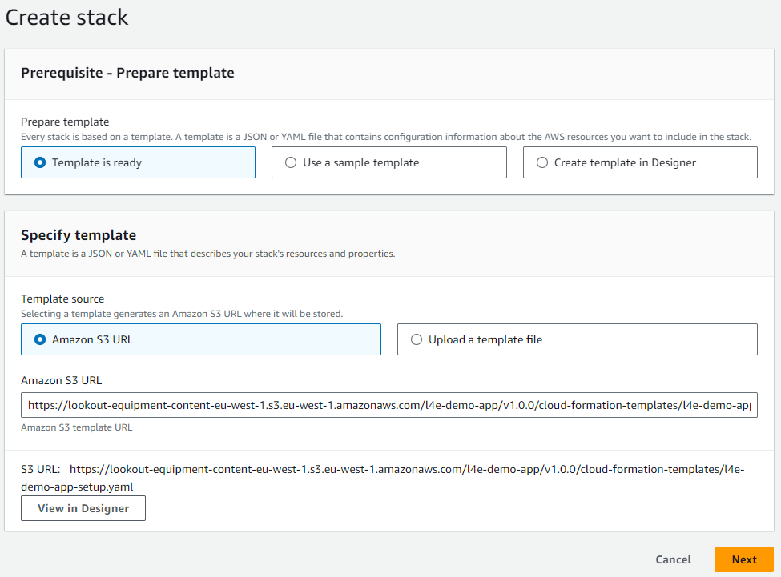

On the parameters page, you will have to fill in:

* `Stack name`: a unique name for your CloudFormation deployment. A default name will have been filled in on your behalf
* `Admin username`: the login the administrator will use to log into the application once installed
* `Admin email`: make sure this is a valid email, the temporary password will be sent to this address
* `Allow new users to sign up in the app`: by default, new users will be able to create their credentials when then land on the authentication page of the app. You can prevent this behavior. Note that in this case, you will have to use the Amazon Cognito console to create the users manually in the backend. However, this will prevent any users with the link to your app to create an account and provision AWS resources in your account
* `S3 bucket`: this bucket will contain all the resources to run this application. Note that a suffix will be added to the name you select to ensure it stays unique
* `Create CloudFront distribution`: the default and recommended parameter is to publish your application behind a CloudFront distribution. This is mandatory if your IT has enforced S3 Block Public Access at an account level. Select "false" if you want your application to be served from a Public S3 bucket (*not recommended*)

Once you're fine with these parameters, click `Next`:

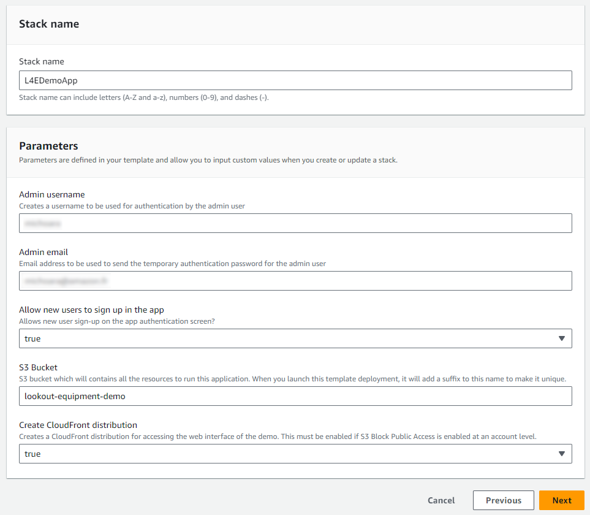

The stack configuration options page will also be fine with the default values, click `Next` to proceed to the Review page. Scroll again to the bottom, check the box to enable the template to create new IAM resources and then click on `Submit`:

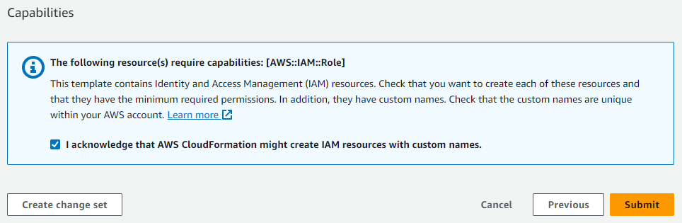

CloudFormation will take a few minutes to create the resources described above on your behalf:

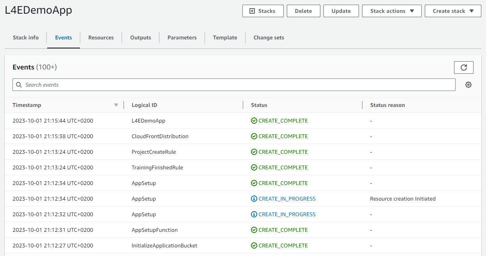

Once it is completed, you will see a green CREATE_COMPLETE message next to the name of the stack (on the left panel of the CloudFormation console), indicating that the deployment is completed.

### Updating the app

When a new release of this application is available in this repository, a notification will appear in the top menu bar of the app:

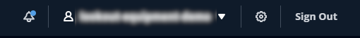

To update the app in your AWS account, follow these steps:

1. Log into your AWS account and navigate to the CloudFormation console
2. Find the initial stack that you deployed at installation time
3. Click the `Update` button at the top and then select `Replace current template`
4. For the Amazon S3 URL, select one of these links, depending on your region:
   - `us-east-1`: https://lookout-equipment-content-us-east-1.s3.amazonaws.com/l4e-demo-app/v1.0.0/cloud-formation-templates/l4e-demo-app-setup.yaml
   - `eu-west-1`: https://lookout-equipment-content-eu-west-1.s3.eu-west-1.amazonaws.com/l4e-demo-app/v1.0.0/cloud-formation-templates/l4e-demo-app-setup.yaml
   - `ap-northeast-1`: https://lookout-equipment-content-ap-northeast-2.s3.ap-northeast-2.amazonaws.com/l4e-demo-app/v1.0.0/cloud-formation-templates/l4e-demo-app-setup.yaml

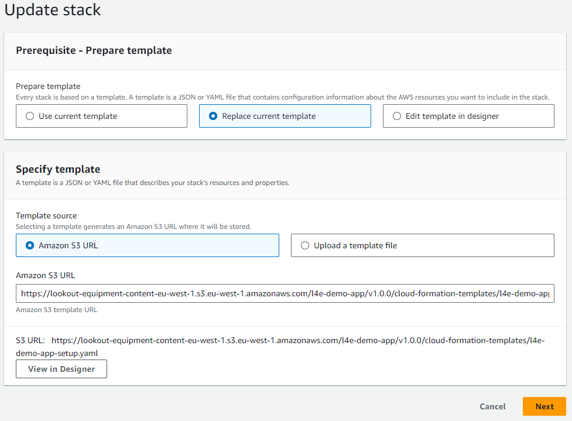

5. Click `Next`: you should be able to keep the same parameters. Click `Next` again twice to reach the Review stage of the update wizard.
6. Scroll to the bottom of the page, check the box to enable the template to create new IAM resources and then click on `Submit`: The CloudFormation template takes a few minutes to refresh your application and the underlying resources.
7. If you deployed your application behind a CloudFront distribution, you need to refresh the cache to reflect the latest frontend that you just deployed. To do this, navigate to the CloudFront console. Select the distribution with the following description: `The distribution for the Lookout for Equipment Demo`.
8. Click on the `Invalidations` tab and then on the `Create invalidation` button:

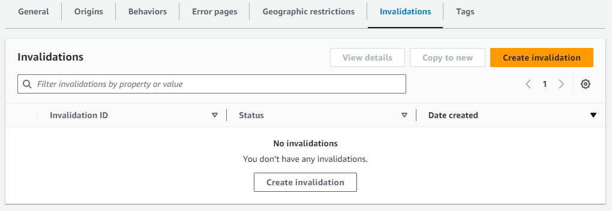

9. Add the following object paths: `/index.html` and `/assets/*` and then click on `Create invalidation`:

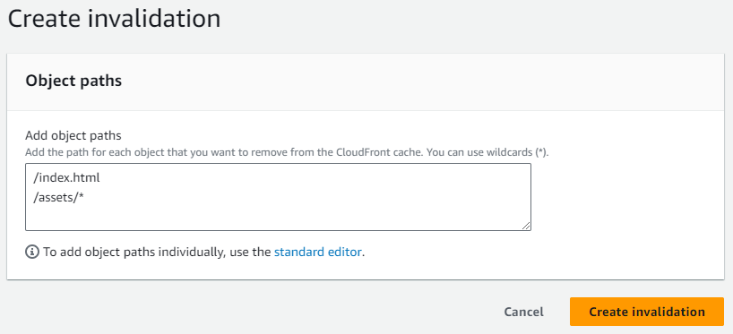

10. You are brought to the `Invalidation details` page. After a couple minutes, your CloudFront distribution cache is updated and you can use your updated app.

### Uninstalling the demo app

To uninstall the app, you can go back into the CloudFormation console, select the stack you deployed and click on `Delete`: click again on the `Delete` button in the confirmation window and most of the resources deployed will be deleted after a few minutes:

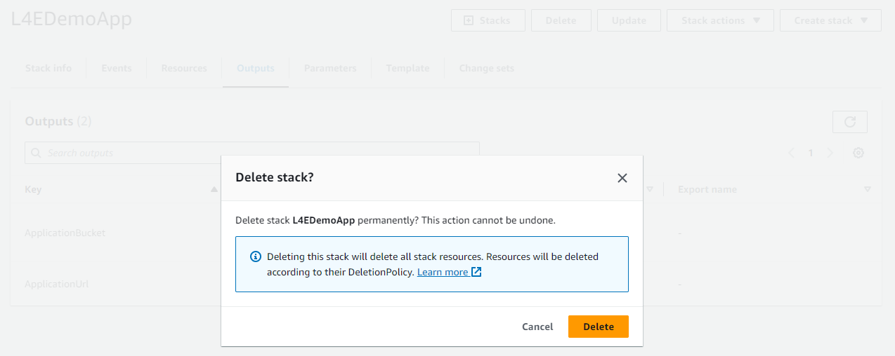

Note that the following resources **won't be deleted**: you can continue using them after the stack is deleted or may go and manually delete them in the console of the different services:

* In **Amazon S3**, the `Application Bucket` will stay: your users will have uploaded their datasets. The deployed models will also store their inference results in this bucket and you may want to keep all these data afterward.
* In **Amazon Lookout for Equipment**, the different datasets, models and schedulers will not be deleted either. Note that you will **continue to incur costs** due to any running inference schedulers. If you don't have any more usage of these schedulers, we recommend that you log into the Lookout for Equipment console and stop any active schedulers (inactive schedulers do not cost anything).

Before deleting the app, you may go into each project dashboard and delete them: this will delete the whole hierarchy of associated resources, including the Lookout for Equipment resources and the files stored in the S3 buckets.

## Usage
Once the template is deployed, stay on the CloudFormation service page and navigate to the `Ouputs` tab:

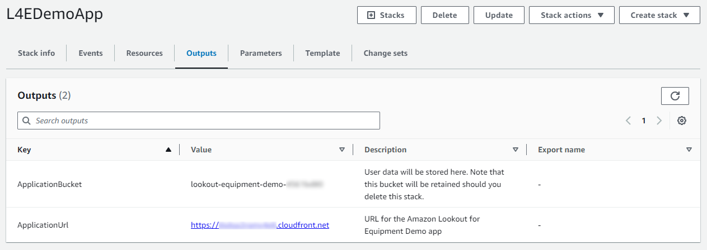

Click on the `ApplicationUrl` link to open the authentication page of the Lookout for Equipment demo application:

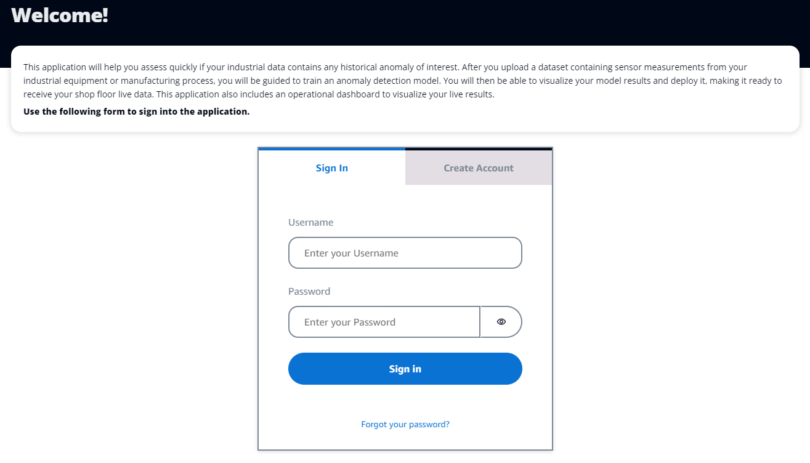

While the CloudFormation template was deploying, you will receive an email with your one-time password to log into the app. Use it to log into the application. You will immediately be requested to change your password. After you change it, you will land on the `Welcome` page of the app:

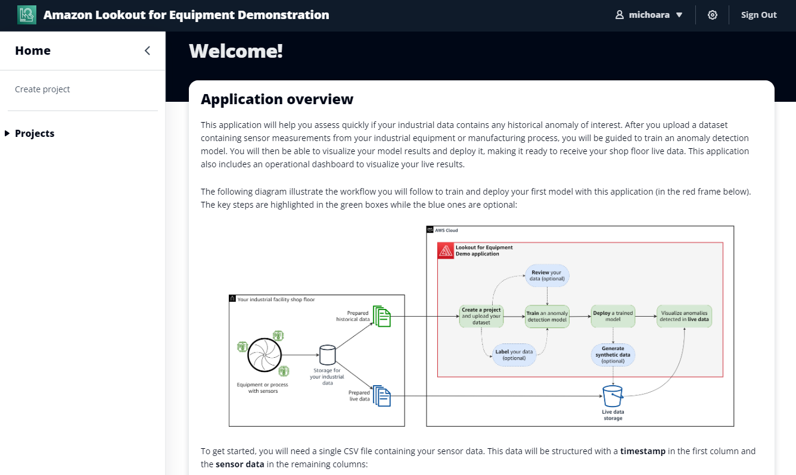

Your application is empty, you are now ready to create your first project!

You can refer yourself to this [User Guide](USER_GUIDE.md) to learn how to make the most out of this application.

## How to manually create user

When deploying the template, you have the option to prevent user to sign up from the app. If you deploy this app behind a CloudFront distribution, anyone with the link can sign up and start creating resources in your AWS account. To prevent this, you can block the
user sign up feature. In this case, you will have to go and create user manually after the template is deployed.

To do this, once the template is deployed, stay on the CloudFormation service page and navigate to the `Ouputs` tab:


Click on the `UserPool` link to open the Cognito User Pool console on the configuration page of your user pool. From there, scroll to the `Users` section and click on the `Create user` button:

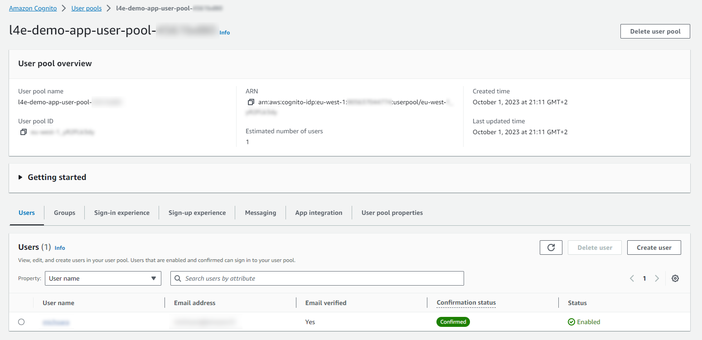

On the user creation page, select the following options:
* Invitation message: `Send an email invitation`
* User name: this will be the login your end user will fill in to connect to the app
* Email address: needed to receive the temporary password
* Temporary password: you can let Cognito generate it for you

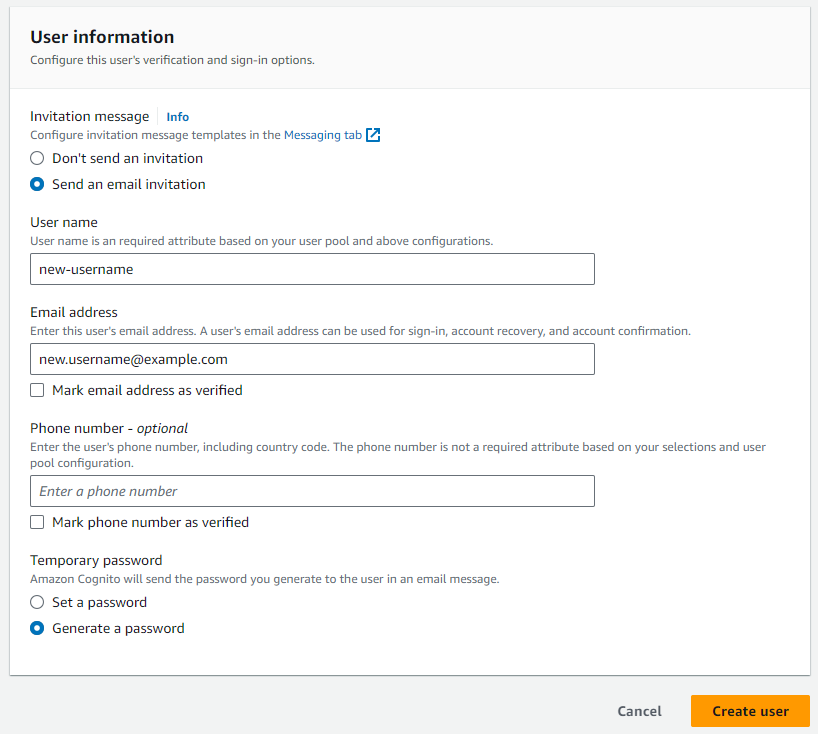

The user will receive a welcome message and will be able to log into your application with these. The user will be prompted to change the account password immediately.

## Architecture overview
This template will deploy the following components in your AWS account:


0. Deploy this AWS Solution into your AWS account. The React frontend is stored in S3 and distributed by CloudFront
1. Open the App and use Amazon Cognito to authenticate.
2. To create a new project, end user uploads a CSV file that will be used to create an Amazon Lookout for Equipment project. Data will also be prepared for visualization purpose in the app. The prepared data will be stored in a DynamoDB table.
3. Once a project is created, user can visualize the project attributes and a summary of the ingested dataset
4. User can also dive deeper in the sensor data, visualize sensor grade results, timeseries and value distributions
5. The labeling page allows users to create labels and group them in label groups.
6. User can train a model. The application will monitor the training process. Once training is finished, the results will be postprocessed: the anomalies and the sensor contributions will be stored in DynamoDB tables.
7. After training, user can visualize model results: anomalies, sensor contribution, sensor behavior deep dive between training and evaluation range (when provided).
8. User can deploy a model. The same page also allows the user to trigger synthetic data generation to populate the input inference bucket based on extracts from the historical data.
9. After a model is deployed, the app will monitor new inference results and store them in DynamoDB tables. Users has access to a deep dive dashboard to understand the anomalies detected in the process or piece of equipment monitored.

### Costs consideration

The main cost driver of this application is the number of Lookout for Equipment models deployed. Each running inference scheduler will cost you $0.25/hr (approx. $180 / month). Make sure you only leave the schedulers you need running and stop the others when you don't need them anymore.

This application leverages Amazon DynamoDB to store precalculated datasets and accelerate visualization. A typical project leveraging a dataset with 2 years of data and 30 sensors will store around 60 MB of data. From a storage perspective, DynamoDB has a free tier of 25 GB per month which should be enough to store several hundreds projects free of charge. The read and write requests necessary to monitor an asset on a daily basis will stay well under $1 / month / project.

All the other resources leverage by the application in the backend (Step Functions, S3, Lambda, CloudFront, EventBridge, and Cognito) will have a negligeable costs (less than $0.50 / month / project).

### Repository structure
This folder is structured as followed:

```
. amazon-lookout-for-equipment-demo-app/
|
├── index.html                          <-- Entry point of the app
|
├── README.md                           <-- This instruction file
|
├── assets/
|   ├── cloud-formation/                <-- The CloudFormation template YAML file definition
|   ├── lambda-functions/               <-- Lambda functions source code (mostly written in Python)
|   ├── layers/                         <-- Lambda layers
|   ├── screenshots/                    <-- Pictures used in this README.md file
|   └── state-machines/                 <-- Step functions JSON definitions
|
├── public/
|   ├── app.config.js                   <-- File generated at deployment time to configure your app
|   └── *.png, *.gif                    <-- All pictures used by the application
|
└── src/                                <-- Source code of the frontend (mostly written in Javascript)
```

## Questions

Please contact the [**Lookout for Equipment team**](mailto:aws-custfeedback-l4edemoapp@amazon.fr?subject=Lookout%20for%20Equipment%20Demo%20App%20Feedback) or raise an issue against this repository.

## Security

See [CONTRIBUTING](CONTRIBUTING.md#security-issue-notifications) for more information.

## License

This library is licensed under the MIT-0 License. See the [LICENSE](LICENSE) file.