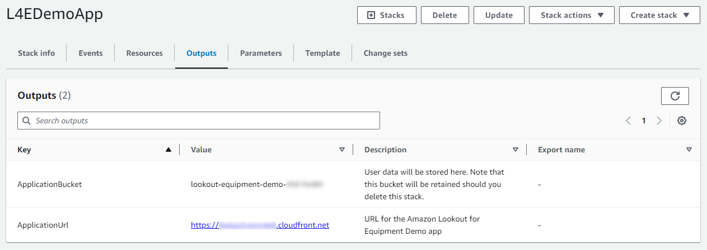
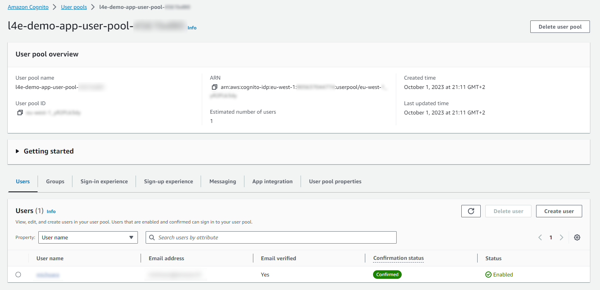

## Usage
### First connection
Once the template is deployed, stay on the CloudFormation service page and navigate to the `Ouputs` tab:

Click on the `ApplicationUrl` link to open the authentication page of the Lookout for Equipment demo application:

While the CloudFormation template was deploying, you will receive an email with your one-time password to log into the app. Use it to log into the application. You will immediately be requested to change your password. After you change it, you will land on the `Welcome` page of the app:

Your application is empty, you are now ready to create your first project!

You can refer yourself to this [User Guide](USER_GUIDE.md) to learn how to make the most out of this application.

### How to manually create user

When deploying the template, you have the option to prevent user to sign up from the app. If you deploy this app behind a CloudFront distribution, anyone with the link can sign up and start creating resources in your AWS account. To prevent this, you can block the
user sign up feature. In this case, you will have to go and create user manually after the template is deployed.

To do this, once the template is deployed, stay on the CloudFormation service page and navigate to the `Ouputs` tab:

Click on the `UserPool` link to open the Cognito User Pool console on the configuration page of your user pool. From there, scroll to the `Users` section and click on the `Create user` button:

On the user creation page, select the following options:
* Invitation message: `Send an email invitation`
* User name: this will be the login your end user will fill in to connect to the app
* Email address: needed to receive the temporary password
* Temporary password: you can let Cognito generate it for you

The user will receive a welcome message and will be able to log into your application with these. The user will be prompted to change the account password immediately.