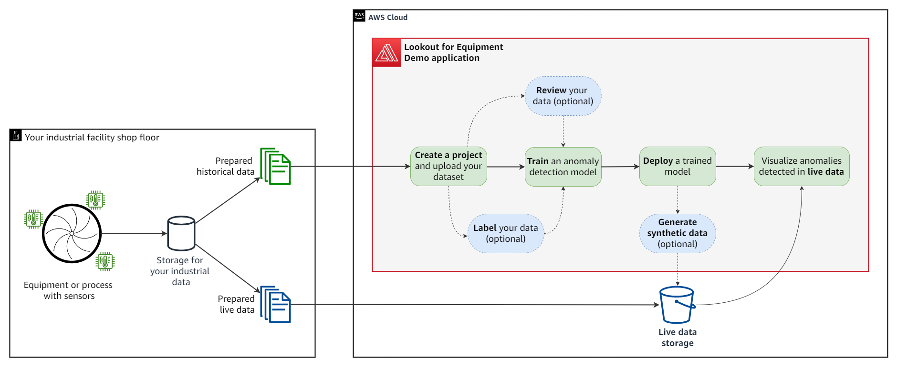

Welcome to Lookout for Equipment Demo Application!
==================================================

This application will help you assess quickly if your industrial data contains 
any historical anomaly of interest. After you upload a dataset containing 
sensor measurements from your industrial equipment or manufacturing process, 
you will be guided to train an anomaly detection model. You will then be able 
to visualize your model results and deploy it, making it ready to receive your 
shop floor live data. This application also includes an operational dashboard 
to visualize your live results.

The following diagram illustrate the workflow you will follow to train and deploy
your first model with this application (in the red frame below). The key steps 
are highlighted in the green boxes while the blue ones are optional:

.. note::

   This project is under active development.

Contents
--------

.. toctree::

   login
   project-creation
   reviewing-dataset
   labeling
   model-training
   model-evaluation
   model-deployment
   online-monitoring
   administration
