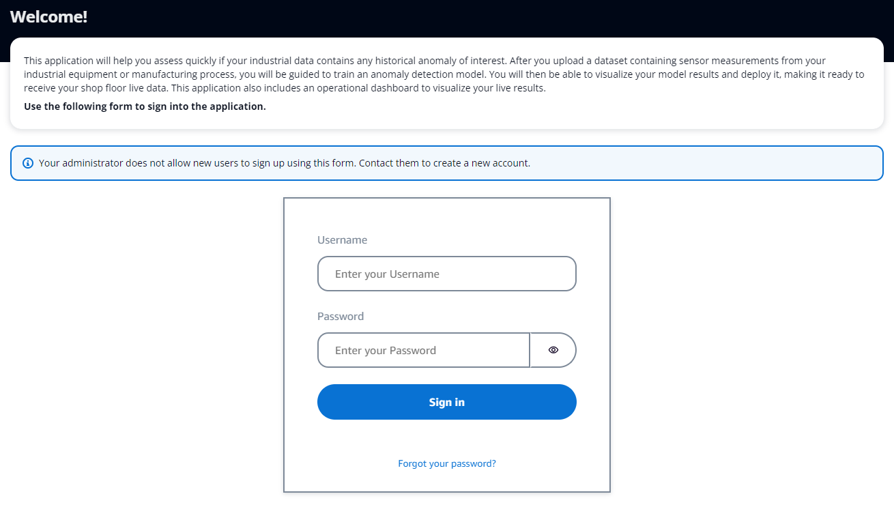
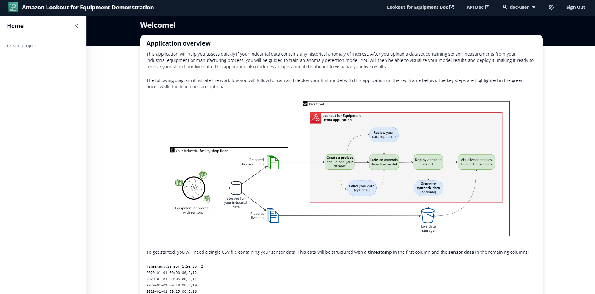
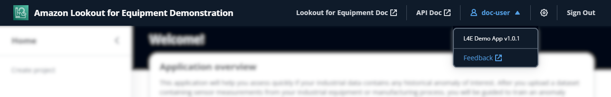
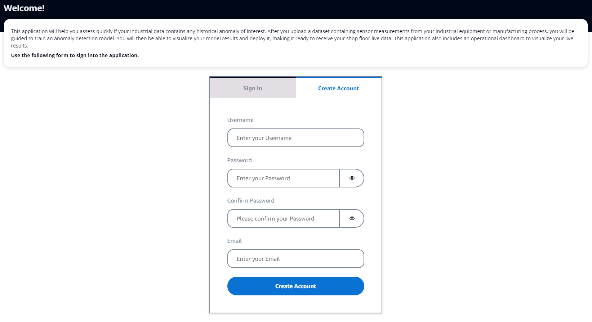

Login
=====

First time login
----------------

After your administrator :ref:`deployed the app <admin installation>` in an
AWS account, you will receive a link to log into the application. In parallel,
you will receive an email with your temporary credentials to login. The first
time you open the application link, you will be presented with a login page:

.. note::
    If your administrator allowed in-app creation of new users, you will have a
    second tab where you will be able to create a new user on a self-serve 
    basis.

Enter the username and password received by email: you will be immediately 
prompted to create a new one. After you're done, you will land on the welcome
page of the application:

What's next?

* To learn more about how to navigate this application, scroll down to the :ref:`Navigation section <login navigation>`.
* To learn how to create new users, scroll down to the :ref:`User management section <login user_creation>`.
* To create your first project, go the :ref:`Project creation section <project creation>`.

.. _login navigation:

Navigating the application
--------------------------

The top menu bar give you access to several links of interest:

From left to right you will find:

* The **application title**: clicking on this title will always bring you back to
  the welcome page, wherever you are in the application.
* Access to the Amazon Lookout for Equipment **official documentation**.
* Access to the official **API documentation** should you need to interact with
  Lookout for Equipment programmatically.
* A drop down menu accessible by clicking on your user name. This will show
  you the **current version** of the app and let you send us a **feedback** by email.
* A cog icon which will give you access to application-wide **settings**.
* A **sign out** button to log out or switch user.

.. _login user_creation:

User creation
-------------

There are two ways to manage users to access this application: in app or manual.

If your administrator **allowed users to sign up directly in the app**, you will see 
a **Create account** tab on the login page:

Fill in your user information and click on the **Create account** button to create
your account and be automatically logged in.

**If in app sign up is not enabled**, your administrator will have to create your 
user in the backend. See :ref:`Creating users <admin user_creation>` to learn more.