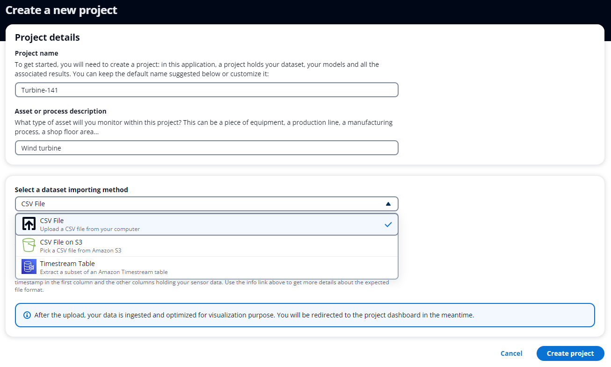
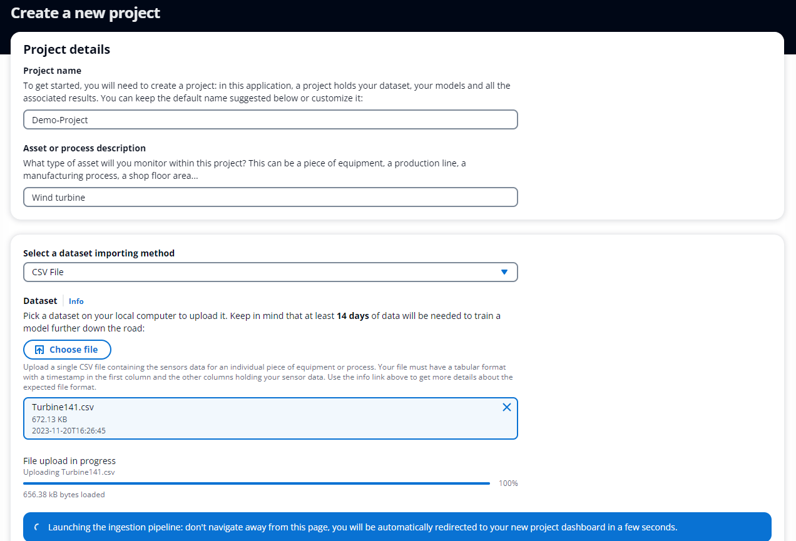
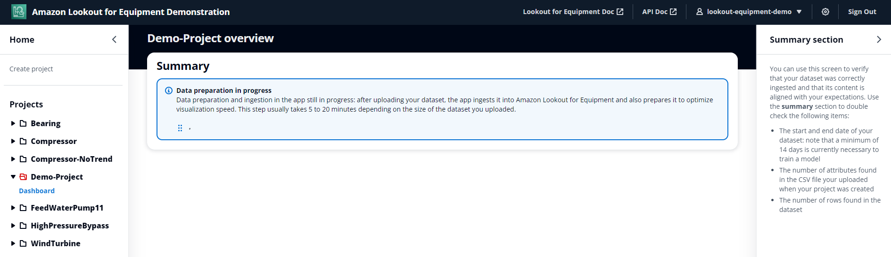
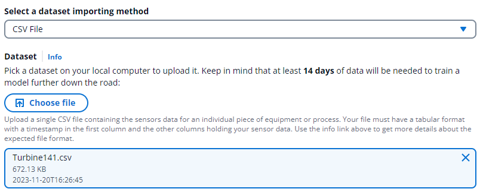
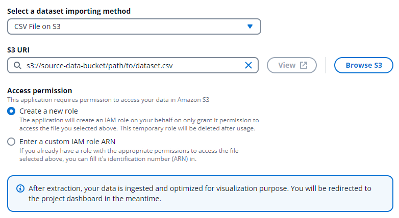

.. _project creation:

Creating a project
==================

Organizing your model hierarchy
-------------------------------
Projects are the first level of your hierachy in a given user account. Depending
on your use case, you may use a single project to host the data for a facility,
a production line (or facility area), or a piece of equipment. A project can store
a time series dataset of up to 3,000 sensors. Within a project, you will be able
to train and deploy multiple anomaly detection models, and each model will be able
to use up to 300 sensors out of the data available within a given project.

The following table gives some examples of different ways you can organize your 
models. This is by no way exhaustive

+----------+-----------------+----------------------------+
| Account  | Project         | Model                      |
+==========+=================+============================+
| Facility | Production line | 1 piece of equipment       |
+----------+-----------------+----------------------------+
| Facility | Facility area   | 1 production line          |
+----------+-----------------+----------------------------+
| User     | Facility        | 1 piece of equipment       |
|          |                 |                            |
|          |                 | All equipment in an area   |
+----------+-----------------+----------------------------+

Currently, each account is isolated. Users logging into the app from different
accounts won't see each other's projects. If you want several users to be able
to visualize shared projects, you can create a team-based account with credentials
that will be shared between different team members. 

Ingesting data to create a new project
--------------------------------------

To monitor your equipment or industrial process, you must provide Amazon Lookout 
for Equipment with time series data with the sensors from your equipment or process.
To create a project, click on **Create project** in the left hand menu. You will
be presented with a form where you can enter the following information to create
a new project:

* ``Project name:`` use up to 170 characters to name your project. Valid characters 
  are a-z, A-Z, 0-9, _ (underscore), and - (hyphen)
* ``Asset or process description:`` What type of asset will you monitor within this 
  project? This can be a piece of equipment, a production line, a manufacturing 
  process, a shop floor area... This is used for future reference so anyone knows
  what this project can monitor
* ``Dataset importing method:`` you can ingest your time series data in the application
  through different methods: CSV file from your computer, CSV file located in an
  Amazon S3 bucket, or an extract from an Amazon Timestream table.

After your select your data source and configure it, you can click on the **Create
project** button to start the ingestion process. A message highlighted in blue
confirms the ingestion process is started. Do not leave this page until you are
automatically redirected to the project detail page:

After a few seconds,the name of your project will appear in the hierarchy on the
left after a few seconds. You will be brought to the project dashboard where you 
can see the ingestion in progress:

Note the red folder icon next to the name of your project in the hierarchy on
the left. This means your project creation is currently in progress. During
the ingestion, the following actions are performed by the application on your
behalf:

* A Lookout for Equipment project is created
* Your raw CSV file is pushed to Amazon S3 and is ingested from there into
  Lookout for Equipment
* A hourly dataset is also created by downsampling your original data. This
  downsampled dataset will be used for visualization purpose throughout the
  application and won't be used for model training purpose.

Loading a CSV file from a computer
----------------------------------
Although Lookout for Equipment accepts a broader set of configuration, this 
application only allow you to upload a single CSV file for the time being. You
will need to arrange your data using this format:

.. code-block::

    Timestamp,Sensor 1,Sensor 2
    2020/01/01 00:00:00,2,12
    2020/01/01 00:05:00,3,11
    2020/01/01 00:10:00,5,10
    2020/01/01 00:15:00,3,16
    2020/01/01 00:20:00,4,12
    ...

You can choose your column names. We recommend using "Timestamp" as the name for 
the column with the time series data. Check the documentation (link below) for 
the allowed formats of the timestamp column. You must have a double (numerical)
as the data type for your sensor data. You can only train your model on numeric 
data. The valid characters that you can use in the column names of the dataset 
are A-Z, a-z, 0-9, . (dot), _ (underscore), and - (hyphen). To learn more about 
data formatting for Lookout for Equipment, check out `this page`_ in the 
documentation of the service.

To upload a dataset, click on **Choose file** then pick a suitable CSV file on your
local computer. An area with your file name, file size and last modification date
is added as a visual feedback:

Click on **Create project** to launch the ingestion process.

Importing a CSV file from Amazon S3
-----------------------------------

You may have some properly formatted CSV files already located in an Amazon S3
location. In this case, you can point the application to their location and let
the ingestion process starts from there. To achieve this, in the ``Dataset importing
method``, select **CSV File on S3**. Then you can either fill in the full S3
path or browse potential locations to pick the CSV file up. Note that when you
use **Browse S3**, you will only be able to visualize the locations that the
underlying AWS account (the one where the app has been deployed in) has access to.
If you want to point to an S3 location owned by another AWS account, you will have
to fill in the full path manually.

To access the S3 location you selected, you need to give the app the appropriate
read permission. You can either let the app create a role with the right permission
or provide the ARN (*Amazon Resource Name*) of an existing role with the appropriate
access. If you let the app create a role, the latter will just be used for copy
the data to the bucket managed by the app. This role will then be deleted.

Extracting data from an Amazon Timestream table
-----------------------------------------------

.. _this page: https://docs.aws.amazon.com/lookout-for-equipment/latest/ug/formatting-data.html